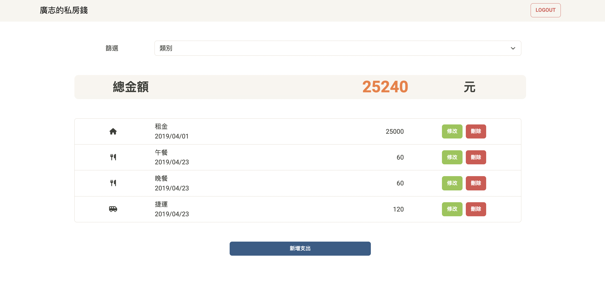

# 我的餐廳清單


## 專案介紹
本專案提供使用者紀錄與管理支出，可進行新增、刪除、編輯、篩選等功能。

## 產品功能
* 使用者可選擇以 Email 或 Facebook 進行註冊
* 登入後可於主頁瀏覽所有支出項目
* 可新增、刪除支出項目
* 可編輯支出內容
* 支出內容可記錄支出名稱、消費日期、類別、金額
* 依據支出類別進行篩選，可得同類別花費總金額

## 開始使用
1. 確認本地已安裝Node.js與npm
2. 打開terminal，輸入以下指令Clone本專案至本地
  ```
  $ git clone https://github.com/Nilney/expense-tracker.git
  ```
3. 進入此專案資料夾
  ```
  $ cd expense-tracker
  ```
4. 輸入以下指令以安裝 npm 套件
  ```
  $ npm install
  ```
5. 參考 `.env.example` 建立 `.env`文件，並於SKIP的部分設置你的環境變數
  ```
  MONGODB_URI=SKIP
  FACEBOOK_ID=SKIP
  FACEBOOK_SECRET=SKIP
  FACEBOOK_CALLBACK=http://localhost:3000/auth/facebook/callback
  PORT=3000
  SESSION_SECRET=SKIP
  ```
6. 可自行依需求使用腳本建立種子資料，內含2位使用者以及5筆支出項目
  ```
  $ npm run seed
  ```
    | User | Email             | Password |
    | :---:| :---------------: | :------: |
    | 廣志 | user1@example.com | 12345678 |
    | 小新 | user2@example.com | 12345678 |
7. 輸入以下指令以啟動本專案
  ```
  $ npm run start
  ```
8. 顯示以下資訊代表本專案順利運行，輸入網址至瀏覽器便可瀏覽此專案網頁
  ```
  App is running on http://localhost:3000
  ```
9. 若要停止使用，請輸入以下指令
  ```
  $ ctrl + c
  ```

## 開發工具
* Node.js @14.16.0
* Express @4.18.2
* Express-handlebars @3.0.0
* Bootstrap 5.1.1
* Font-awesome 6.3.0
* 其餘詳見package.json